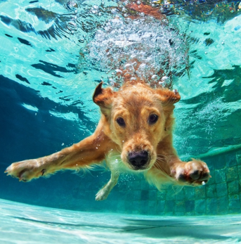
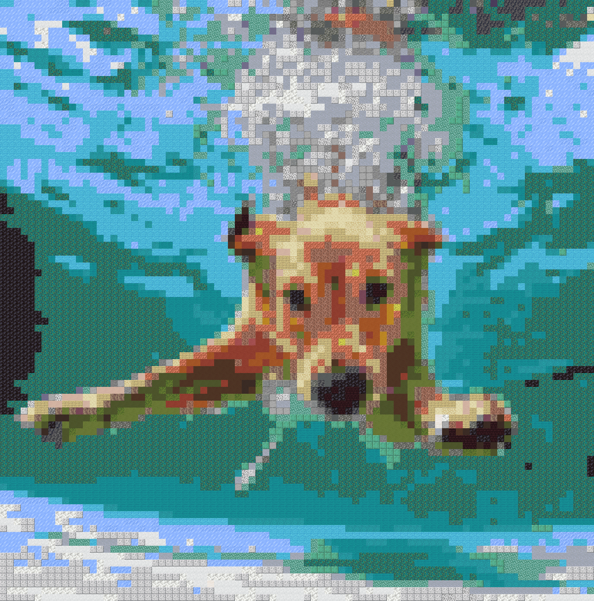

# 🧱 Minecraft Image Converter

Turn any image into Minecraft-style art using real block textures.

This project analyzes an image and rebuilds it using Minecraft blocks based on color similarity.

---

## 📸 Example

Original image → Rebuilt using Minecraft blocks

### Before


### After


---

## ⚙️ Requirements

Install the required library:

```bash
pip install pillow
```

---

## 📂 How to use

1. Place your images inside the **read** folder

2. Run the script:

   `python converter.py`

3. The processed images will be saved in the **result** folder

> Note: Higher resolution images may make individual Minecraft blocks less noticeable.

---

## 📁 Project structure

```
minecraft-image-converter/
│
├── converter.py
├── block/
├── read/
├── result/
├── examples/
│   ├── example1.png
│   └── example2.png
└── README.md
```

---

## 🧠 How it works

* The image is divided into small regions
* Each region's average color is calculated
* The closest matching Minecraft block is selected
* The image is rebuilt using block textures

---

## 🚀 Features

* Supports multiple images at once
* Uses real Minecraft textures
* Automatic color matching
* Scalable output resolution

---

## 🐍 Built with

* Python
* Pillow (PIL)

---

## 🔗 Source

Made with Python 🐍
